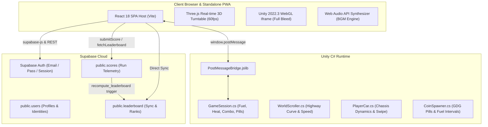
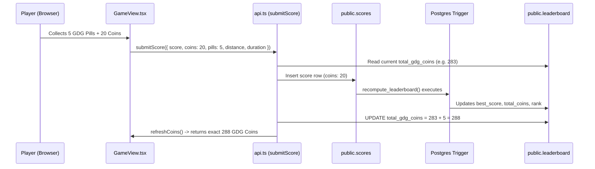

# GDG Go (GDGoC Go!) — Project Architecture & Engineering Handoff

> **Repository:** `https://github.com/Karang1908/gdgoc-go.git`  
> **Workspaces:**
> - Primary WebGL + React Hosting: `/Users/karangarg/Desktop/gdg-go`
> - Reference Google Design System: `/Users/karangarg/Desktop/councilonboarding`
>
> **Git Commit Author Rule:** Always commit file-by-file with `--author="Karang1908 <Karang1908@users.noreply.github.com>"`.

---

## Table of Contents

1. [Executive Summary & High-Level Architecture](#1-executive-summary--high-level-architecture)
2. [Frontend Architecture (React 18 + Vite + Three.js)](#2-frontend-architecture-react-18--vite--threejs)
3. [Unity WebGL Engine & C# Gameplay System](#3-unity-webgl-engine--c-gameplay-system)
4. [Bidirectional Unity-React Communication Bridge](#4-bidirectional-unity-react-communication-bridge)
5. [Database, Authentication & Leaderboard Engine (Supabase)](#5-database-authentication--leaderboard-engine-supabase)
6. [Mobile Optimization, PWA & Zero-Scroll Viewport Rules](#6-mobile-optimization-pwa--zero-scroll-viewport-rules)
7. [Google Material 3 Design System Contracts](#7-google-material-3-design-system-contracts)
8. [Common Errors, Gotchas & Debugging Solutions](#8-common-errors-gotchas--debugging-solutions)
9. [Build, Deployment & Verification Playbook](#9-build-deployment--verification-playbook)

---

## 1. Executive Summary & High-Level Architecture

**GDG Go** (*GDGoC Go!*) is a high-performance 3D endless police chase getaway game and competitive leaderboard web application built for Google Developer Groups on Campus (BITS Pilani Dubai Campus).

Players step into a getaway vehicle, dodge highway traffic, jump obstacles, collect GDG Energy Coins and rare GDG Pills, preserve engine fuel, and compete for global rank standings with one personal best per driver.



---

## 2. Frontend Architecture (React 18 + Vite + Three.js)

The web client is located under [`web-hosting/`](file:///Users/karangarg/Desktop/gdg-go/web-hosting) and built using React 18, TypeScript, and Vite 6.

### Key Components & Directories

| Path | Description |
|---|---|
| [`src/App.tsx`](file:///Users/karangarg/Desktop/gdg-go/web-hosting/src/App.tsx) | Root application router, global theme provider, top navigation lockup, and 4-color Google footer. |
| [`src/home/Home.tsx`](file:///Users/karangarg/Desktop/gdg-go/web-hosting/src/home/Home.tsx) | Landing page router: renders Split Hero for guests and Garage Vehicle Selector for authenticated users. |
| [`src/home/CarPicker.tsx`](file:///Users/karangarg/Desktop/gdg-go/web-hosting/src/home/CarPicker.tsx) | Vehicle showroom selector with 3D turntable, spec meters, launch CTA, and bottom dock. |
| [`src/home/GameView.tsx`](file:///Users/karangarg/Desktop/gdg-go/web-hosting/src/home/GameView.tsx) | Edge-to-edge game container embedding Unity iframe, audio controls, and postMessage event handlers. |
| [`src/home/ResultOverlay.tsx`](file:///Users/karangarg/Desktop/gdg-go/web-hosting/src/home/ResultOverlay.tsx) | Game over summary modal showing Final Score, Distance, Standard Coins, exact GDG Coins, and Banked Total. |
| [`src/leaderboard/Leaderboard.tsx`](file:///Users/karangarg/Desktop/gdg-go/web-hosting/src/leaderboard/Leaderboard.tsx) | Global standings view with side-by-side top podium, search bar, refresh button, and responsive table. |
| [`src/components/CarShowcase3D.tsx`](file:///Users/karangarg/Desktop/gdg-go/web-hosting/src/components/CarShowcase3D.tsx) | Three.js real-time 60fps 3D car showroom turntable with procedural studio lighting and rotation. |
| [`src/components/UnityEmbed.tsx`](file:///Users/karangarg/Desktop/gdg-go/web-hosting/src/components/UnityEmbed.tsx) | Full-bleed WebGL iframe container with touch event forwarding and resize synchronization. |
| [`src/components/AuthModal.tsx`](file:///Users/karangarg/Desktop/gdg-go/web-hosting/src/components/AuthModal.tsx) | On-demand modal dialog with Google transparent blue capsule tabs and circular close button. |
| [`src/lib/api.ts`](file:///Users/karangarg/Desktop/gdg-go/web-hosting/src/lib/api.ts) | Supabase score submission, leaderboard queries, cumulative coin calculations, and REST fallbacks. |
| [`src/lib/bgm.ts`](file:///Users/karangarg/Desktop/gdg-go/web-hosting/src/lib/bgm.ts) | Web Audio API synthesizer engine with automatic touch/click unlock for mobile webapps. |

---

## 3. Unity WebGL Engine & C# Gameplay System

The Unity project is located under [`unity-project/`](file:///Users/karangarg/Desktop/gdg-go/unity-project) (built with Unity 2022.3 LTS).

### 1. Vehicle Configurations ([`data/cars.ts`](file:///Users/karangarg/Desktop/gdg-go/web-hosting/src/data/cars.ts))

| Vehicle ID | Name | Chassis | Speed | Handling | Durability | Color Theme |
|---|---|---|---|---|---|---|
| `sports` | **Velocity GT** | High-Speed Interceptor | 95 | 85 | 60 | `#EA4335` (Google Red) |
| `formula` | **Apex Racer** | Track-Tuned Formula | 98 | 90 | 45 | `#4285F4` (Google Blue) |
| `suv` | **Titan Enforcer** | Armored Highway Cruiser | 72 | 65 | 95 | `#FBBC04` (Google Yellow) |
| `tuner` | **Metro Sprinter** | Agile Urban Street Racer | 82 | 94 | 70 | `#34A853` (Google Green) |

### 2. Core Game Loop ([`GameSession.cs`](file:///Users/karangarg/Desktop/gdg-go/unity-project/Assets/Scripts/Core/GameSession.cs))
- **Fuel Mechanics:**
  - Initial fuel: 100% (`maxFuel = 100f`).
  - Fuel consumption rate: `fuelDrainPerSecond = 1.6f`.
  - Fuel refill item: spawns every 85 meters (reduced to 45 meters when fuel <= 25%).
- **Heat & Police Pursuit:**
  - Highway police cars chase from behind with siren audio.
  - Hitting cars increases heat; running dry or getting captured triggers Game Over.
- **Coin & GDG Pill Mechanics:**
  - Standard Coins: 1 base point, increments multiplier combo.
  - Guaranteed GDG Pills: Spawns every 100 meters (`pillMilestoneInterval = 100f`), awards +25 pts and +1 permanent GDG Coin.
  - GDG Pill unlock distance: `gdgPillUnlockDistance = 25f`.

---

## 4. Bidirectional Unity-React Communication Bridge

### Unity → React (PostMessage)
In [`PostMessageBridge.jslib`](file:///Users/karangarg/Desktop/gdg-go/unity-project/Assets/Plugins/WebGL/PostMessageBridge.jslib):
```javascript
ReportGameOverToHost: function(jsonPtr) {
    var json = UTF8ToString(jsonPtr);
    window.parent.postMessage(JSON.parse(json), "*");
}
```

#### JSON Payload Format
```json
{
  "type": "gameover",
  "score": 965,
  "coins": 20,
  "pills": 5,
  "distance": 399,
  "duration": 17,
  "reason": "police"
}
```

### React → Unity
React sends selected vehicle chassis ID into Unity upon launch:
```javascript
iframe.contentWindow.postMessage({ type: 'selectCar', carId: 'sports' }, '*');
```

---

## 5. Database, Authentication & Leaderboard Engine (Supabase)

The backend runs on Supabase (PostgreSQL 15) configured in [`src/lib/supabase.ts`](file:///Users/karangarg/Desktop/gdg-go/web-hosting/src/lib/supabase.ts).

### Database Tables

1. **`public.users`**:
   - `id (uuid, PK)`: Foreign key matching `auth.users(id)`.
   - `username (text, unique)`: User handle.
   - `display_name (text)`: Custom display name.
2. **`public.scores`**:
   - `id (uuid, PK)`, `user_id (uuid, FK)`, `username`, `display_name`.
   - `score (int)`, `coins (int)`, `distance (int)`, `duration_seconds (int)`, `created_at (timestamptz)`.
3. **`public.leaderboard`**:
   - `user_id (uuid, PK)`: One record per user.
   - `best_score (int)`, `total_coins (int)`, `total_gdg_coins (int)`, `best_distance (int)`, `total_games (int)`, `rank (int)`, `last_played (timestamptz)`.

### GDG Coin Accumulation & Synchronization Pipeline


---

## 6. Mobile Optimization, PWA & Zero-Scroll Viewport Rules

The entire application is engineered for **zero-scroll fit** on mobile devices, tablets, and desktop displays:

1. **Definite Viewport Locking**:
   - `html, body, #root, .app-root`:
     ```css
     height: 100dvh;
     max-height: 100dvh;
     width: 100%;
     overflow: hidden;
     box-sizing: border-box;
     ```
2. **Safe Area Insets**:
   - Safe areas for iPhone dynamic island and home indicator:
     ```css
     padding-top: env(safe-area-inset-top, 0px);
     padding-bottom: env(safe-area-inset-bottom, 0px);
     ```
3. **Progressive Web App (PWA)**:
   - `manifest.json` with `display: "standalone"`, `orientation: "any"`.
   - Meta tags: `apple-mobile-web-app-capable`, `mobile-web-app-capable`, `viewport-fit=cover`.

---

## 7. Google Material 3 Design System Contracts

Based on [`councilonboarding/DESIGN.md`](file:///Users/karangarg/Desktop/councilonboarding/DESIGN.md):

- **Brand Colors**:
  - Blue: `#4285F4` (`--g-blue`, `--accent`)
  - Red: `#EA4335` (`--g-red`)
  - Yellow: `#FBBC04` (`--g-yellow`)
  - Green: `#34A853` (`--g-green`)
- **Footer Brand Indicator**: 4 inline brand dots (`--g-blue`, `--g-red`, `--g-yellow`, `--g-green`) alongside `BITS Pilani Dubai Campus`.
- **Active Tab Pill**: Transparent blue bubble (`background: var(--accent-soft); border: 1.5px solid var(--accent); color: var(--accent);`).
- **Typography Scale**: Display title `clamp(2.2rem, 4.4vw, 3.75rem)`, subheader `clamp(1.35rem, 2.6vw, 1.85rem)`.

---

## 8. Common Errors, Gotchas & Debugging Solutions

This section captures the critical bugs identified and resolved during this development cycle:

### 1. Mobile Dark Mode Navbar Overflow & Blowout
- **Symptom**: On mobile dark mode, the page blew out horizontally to ~700px width with horizontal scrollbars.
- **Mechanism**: `:root[data-theme='dark'] .logo-dark { display: block; }` was unscoped and forcibly displayed the 240px wide desktop wordmark alongside the 24px mobile mark on phone screens.
- **Solution**: Scoped the rule strictly to `.logo-desktop.logo-dark { display: block; }` and ensured `.logo-mobile-mark` is the sole visible brand element on mobile screens.

### 2. Indefinite `min-height: 100vh` vs Definite `height: 100dvh`
- **Symptom**: Car thumbnail cards in the garage disappeared behind the bottom footer.
- **Mechanism**: Setting `min-height: 100vh` creates an indefinite container height in CSS. Child containers with percentage heights (`height: 100%`) cannot resolve their dimensions and expand past the viewport, pushing elements beneath sticky footers.
- **Solution**: Set definite `height: 100dvh; max-height: 100dvh; overflow: hidden;` on root containers and use flexbox pinning (`flex: 1 1 auto; min-height: 0;` on stage, `flex: 0 0 auto;` on dock).

### 3. Disproportionate Showcase Card with Dead Void Space
- **Symptom**: The vehicle selector card stretched over 600px tall on laptops, scattering the title to the top right, description to the middle, stats to the bottom, and leaving empty black space around the 3D car.
- **Mechanism**: `.showcase-card` had `height: 100%` and `.showcase-details` used `justify-content: space-between`.
- **Solution**: Capped `.showcase-card` to `max-width: 860px`, set `aspect-ratio: 4 / 3` on the 3D stage, and grouped the right column with a cohesive `8px–12px` gap.

### 4. GDG Coins Displaying Math.floor(Coins / 15) Instead of Actual Count
- **Symptom**: Player collected 6 GDG coins in a run, but the result overlay showed `+2 GDG Coins`.
- **Mechanism**: `GameView.tsx` omitted `pills` from `GameOverPayload`, and `ResultOverlay.tsx` was computing `Math.floor(payload.coins / 15)` from standard yellow coins (e.g., 35 / 15 = 2).
- **Solution**: Forwarded `pills: Number(data.pills) || 0` in `GameView.tsx` and updated `ResultOverlay.tsx` to display `+${payload.pills}`.

### 5. Postgres Trigger Overwriting Exact GDG Coins on Leaderboard
- **Symptom**: Player collected 5 GDG coins, interface showed 5, but Supabase leaderboard updated by only +1.
- **Mechanism**: The Postgres trigger `recompute_leaderboard()` on `scores` table was using legacy formula `coalesce(sum(greatest(1, floor(s.coins / 15))), 0)` because production `scores` schema had no `pills` column.
- **Solution**: In `submitScore()`, queried the driver's current `total_gdg_coins` prior to insert, and immediately updated `public.leaderboard` with `total_gdg_coins = current_gdg_coins + payload.pills` after the score insert.

### 6. Mobile Leaderboard Layout Clipping & Overlap
- **Symptom**: "Back to Game" button overlapped the "GLOBAL LEADERBOARD" badge on mobile, and stacked podium cards pushed the table off screen.
- **Solution**: Refactored header into a flex row and made top podium cards render side-by-side (`grid-template-columns: repeat(auto-fit, minmax(130px, 1fr))`) with compact padding and internal smooth scrolling.

### 7. iOS/Safari Web Audio Autoplay Restrictions
- **Symptom**: No background music or engine sound played on mobile Safari webapps.
- **Mechanism**: Mobile browsers block `AudioContext` until direct user gesture.
- **Solution**: Added passive multi-event listeners (`keydown`, `click`, `touchstart`) on `window` to automatically resume the `AudioContext` on the very first touch.

---

## 9. Build, Deployment & Verification Playbook

### Standard Commands

```bash
# 1. Install dependencies
cd web-hosting
npm install

# 2. Build SPA for production (TypeScript + Vite)
npm run build:spa

# 3. Full build (copies Unity WebGL Build assets into web-hosting/dist)
npm run build

# 4. Preview build locally
npx vite preview --port 4173
```

### Visual Verification with Playwright (Headless Chrome)
```bash
python3 -c "
from playwright.sync_api import sync_playwright

with sync_playwright() as p:
    browser = p.chromium.launch(headless=True)
    
    # Desktop verification (1440x900)
    ctx = browser.new_context(viewport={'width': 1440, 'height': 900})
    page = ctx.new_page()
    page.goto('http://localhost:4173')
    page.screenshot(path='desktop-verify.png')

    # Mobile iPhone 14 verification (390x844)
    m_ctx = browser.new_context(viewport={'width': 390, 'height': 844}, is_mobile=True, has_touch=True)
    m_page = m_ctx.new_page()
    m_page.goto('http://localhost:4173')
    m_page.screenshot(path='mobile-verify.png')

    browser.close()
"
```
